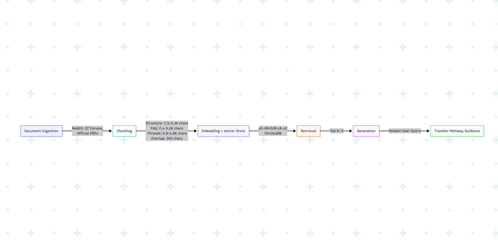

# Project 1 Planning: The Unofficial Guide

> Write this document before you write any pipeline code.
> Your spec and architecture diagram are what you'll use to direct AI tools (Claude, Copilot, etc.) to generate your implementation — the more specific they are, the more useful the generated code will be.
> Update the Retrieval Approach and Chunking Strategy sections if you change your approach during implementation.
> Update this file before starting any stretch features.

---

## Domain

<!-- What domain did you choose? Why is this knowledge valuable and hard to find through official channels? -->

Transfer pathway from community colleges, CA CCC, to 4-year universities, UC/CSU.

Having an accurate information on transfer pathway is crucial because taking one wrong step can prevent students from being admitted to 4-year universities. This knowledge is also valuable in financial and timing perspective because being unaware of what set of courses to take can eventually lead to loss of financial aid and spending more time than necessary at a community college.

This domain can be challenging for community college students to navigate because requirements can differ, depending on various factors such as major requirements, general education, sepcific school requirements, and units requirements. Additionally, transfer requirements often change each year, which can possibliy creat confusion amongs transfer students. Some universities official website also have outdated transfer requirements. 

---

## Documents

<!-- List your specific sources: URLs, subreddit names, forum threads, or file descriptions.
     Aim for at least 10 sources that together cover different subtopics or perspectives within your domain. -->

| # | Source | Description | URL or location |
|---|--------|-------------|-----------------|
| 1 | r/uctransfer (subreddit) | Unofficial: day-to-day transfer Q&A, admit results, real timelines | https://www.reddit.com/r/uctransfer/ |
| 2 | r/CollegeTransfer (subreddit) | Unofficial: general transfer advice beyond just UC | https://www.reddit.com/r/CollegeTransfer/ |
| 3 | r/ApplyingToCollege (transfer posts) | Unofficial: essays, application strategy, decision threads | https://www.reddit.com/r/ApplyingToCollege/ |
| 4 | College Confidential — UC Transfer FAQs Part 1 | Unofficial curated FAQ: TAG, IGETC, TAP programs, unit caps | https://talk.collegeconfidential.com/t/uc-transfer-faqs-part-1/1996661 |
| 5 | College Confidential — UC Transfers board | Unofficial forum threads: rescinded admits, GPA by major, P/NP | https://talk.collegeconfidential.com/c/transfer-students/uc-transfers/76 |
| 6 | College Confidential — "Is TAG 100% guaranteed?" thread | Unofficial: why TAGs get revoked (missing transcripts, unmet conditions) | https://talk.collegeconfidential.com/t/do-all-students-that-get-their-tag-approved-have-a-100-chance-of-being-admitted/1345277 |
| 7 | UC Davis student TAG blog | First-person walkthrough of the TAG process and pitfalls | https://www.ucdavis.edu/admissions/blog/transfer-admission-guarantee-guide-attend-your-dream-school |
| 8 | Edvisorly — "What is an Articulation Agreement?" | Unofficial guide: plain-English explanation of how credits transfer | https://www.edvisorly.com/student-guides/what-is-an-articulation-agreement |
| 9 | ASSIST.org | Official: which CC courses satisfy major + GE requirements | https://assist.org/ |
| 10 | UC TAG matrix (2026–27) | Official: exact GPA, unit, and deadline requirements per campus | https://admission.universityofcalifornia.edu/_assets/files/transfer-requirements/uc-tag-matrix_2026-2027.pdf |
| 11 | UC Transfer Requirements page | Official: junior standing, 7-course pattern, min GPA (2.4 res / 2.8 nonres) | https://admission.universityofcalifornia.edu/admission-requirements/transfer-requirements/uc-transfer-programs/transfer-admission-guarantee-tag.html |
| 12 | UC Transfer Application Guide (PDF) | Official: importing TAP coursework, TAU, deadlines | https://admission.universityofcalifornia.edu/_assets/files/how-to-apply/application-guide-transfer-applicants.pdf |

---

## Chunking Strategy

<!-- How will you split documents into chunks?
     State your chunk size (in tokens or characters), overlap size, and explain why those
     numbers fit the structure of your documents.
     A review-heavy corpus warrants different chunking than a long FAQ. -->

     Documents will be split into chucnks based on types of documents

     1. ASSIST, UC TAG matrix, transfer requirements, application PDF will be under structure/official document category because it contains dense rules, tables, bullet lists.

     2. College Confidential FAQ, Edvisorly, UC Davis blog will be under FAQ/Guide category because it includes Q&A and step-by-step sections.

     3. Reddit, CC form threards will be under thread/discussion because it will consist of short posts & replies, anecdotes, and timelines.

     - For FAQ/Guide (College Confidential FAQ, Edvirosrly, UC Davis blog)

**Chunk size:**

     1. Structure/official documen: Appproximate of 1,500-2,400 characters 

     2. FAQ/Guide will mostly contain one question and one answer block. Approximate of 2,400 - 3,200 characters will be the chunk size

     3. Reddit/CC form threards: Approximate of 800-1,600

**Overlap:**

     ~ 300 characters across all categories. For official docs, overlap is especially important: when a rule and its exception land on either side of a chunk boundary (e.g., minimum GPA in one paragraph, major-specific threshold in the next), the repeated 300 characters give retrieval a second chance to capture the full condition set.

**Reasoning:**

     1. Structure/official documents (TAG matrix, transfer requirements, application PDF) pack answers into tables, bullet lists, and multi-condition rules. Medium chunks (~1,500–2,400 characters) aim to keep a full requirement block together (e.g., campus + GPA + unit minimum + deadline). Overlap mitigates boundary splits where a base rule and its exception would otherwise land in separate chunks.

     2. FAQ/Guide will mostly contain one question and one answer block. 

     3. Reddit/CC form threards are usually one useful answer or a comment while the rest of a threat can be unreleated replies.

---

## Retrieval Approach

<!-- Which embedding model are you using (e.g., all-MiniLM-L6-v2 via sentence-transformers)?
     How many chunks will you retrieve per query (top-k)?
     If you were deploying this for real users and cost wasn't a constraint, what tradeoffs
     would you weigh in choosing a different embedding model — context length, multilingual
     support, accuracy on domain-specific text, latency? -->

**Embedding model:**
all-MiniLM-L6-v2 via sentence-transformers

**Top-k:** 
5 because too few chunks can miss context, and excessive chucnks can add noise from unrelated forum replies.

**Production tradeoff reflection:**

Context Length

     Drawbacks:
          - MiniLM has a relatively small maximum sequence length compared to some newer embedding models.
          - Long chunks may be truncated
          -  Can lose important context

     Alternatives:
          - Faster embeddings
          - Often more focused embeddings

Multilingual Support

     Drawbacks:
          - Primarily optimized for English retrieval.
          - Cross-language retrieval quality may be inconsistent.
          - May perform poorly if users submit queries in languages different from the source documents.

     Alternatives:
          - BAAI/bge-m3
          - paraphrase-multilingual-MiniLM-L12-v2
          - multilingual-e5-large
          These models are designed to map semantically equivalent text from different languages into similar vector spaces.

Accuracy on domain-specific text

     Drawbacks:
          - General-purpose model; not specifically trained on college admissions, transfer requirements, or educational advising content.
          - May miss subtle relationships between admissions terminology and forum language.
          - Can retrieve semantically similar but less relevant forum posts when terminology is ambiguous.

     Alternatives:
          - text-embedding-3-large — stronger semantic understanding and retrieval accuracy.
          - BAAI/bge-large-en-v1.5 — higher-quality open-source retrieval model.
          - Domain-specific embedding models (if available for education/admissions data).

Latency

     Drawbacks:
          - Lower retrieval quality compared to larger embedding models.
          - May require more tuning of chunk size and Top-k to achieve similar retrieval performance.

     Alternatives:
          - text-embedding-3-large — higher retrieval quality but slower due to API calls and larger model complexity.
          - BAAI/bge-large-en-v1.5 — better retrieval accuracy but increased inference time and hardware requirements.

---

## Evaluation Plan

<!-- List your 5 test questions with their expected correct answers.
     Questions should be specific enough that you can judge whether the system's response
     is right or wrong. "What are good dining halls?" is too vague.
     "What do students say about wait times at [dining hall name] during lunch?" is testable. -->

| # | Question | Expected answer |
|---|----------|-----------------|
| 1 | What is the minimum GPA a California resident needs to be eligible to transfer to a UC? | 2.4 (non-residents: 2.8). Note this is minimum eligibility, not a competitive GPA for admission. Source: UC Transfer Requirements (#11) |
| 2 | Is a UC TAG a 100% guarantee of admission once approved? | No. TAG can be revoked if contract conditions aren't met — e.g. missing transcripts, unmet GPA, incomplete required coursework. Sources: CC "Is TAG 100% guaranteed?" thread (#6), UC Davis TAG blog (#7) |
| 3 | How do I find which community college courses satisfy my major prep for a specific UC campus? | Use ASSIST.org — select your CC, target UC, and major to see articulated/equivalent courses. Sources: ASSIST (#9), Edvisorly articulation guide (#8) |
| 4 | How many units do I need to reach junior standing for UC transfer? | 60 semester units or 90 quarter units of transferable coursework. Source: UC Transfer Requirements (#11) |
| 5 | Can I use Pass/No Pass (P/NP) grades for courses required to transfer to a UC? | Generally no for major prep and most required transfer courses — UCs typically require letter grades. P/NP is usually limited (e.g., some GE). Source: College Confidential UC Transfers board (#5) |

---

## Anticipated Challenges

<!-- What could go wrong? Name at least two specific risks with reasoning.
     Consider: noisy or inconsistent documents, missing source attribution, off-topic
     retrieval, chunks that split key information across boundaries. -->

1. Official UC requirements change yearly, but Reddit and College Confidential threads may be from 2022–2024 with old GPAs, deadlines, or policies. The model could retrieve an outdated forum post and present it as current fact, or blend official and unofficial guidance without flagging the conflict.

2. Dense official docs (TAG matrix PDF, transfer requirements page) often put a rule in one line and exceptions in the next (e.g. minimum GPA + major-specific higher thresholds). Fixed-size chunking with limited overlap could split “2.4 minimum” from “but Engineering requires 3.2,” so retrieval returns only half the answer.

---

## Architecture

<!-- Draw a diagram of your pipeline showing the five stages:
     Document Ingestion → Chunking → Embedding + Vector Store → Retrieval → Generation
     Label each stage with the tool or library you're using.
     You can use ASCII art, a Mermaid diagram, or embed a sketch as an image.
     You'll use this diagram as context when prompting AI tools to implement each stage. -->

---

## AI Tool Plan

<!-- For each part of the pipeline below, describe:
     - Which AI tool you plan to use (Claude, Copilot, ChatGPT, etc.)
     - What you'll give it as input (which sections of this planning.md, which requirements)
     - What you expect it to produce
     - How you'll verify the output matches your spec

     "I'll use AI to help me code" is not a plan.
     "I'll give Claude my Chunking Strategy section and ask it to implement chunk_text()
     with my specified chunk size and overlap" is a plan. -->

     AI tool: Claude & Cursor

     Input: 
          - Chunking Strategy + Documents table from planning.md, requirements.txt,
          - sample files in documents/ (.txt, .html, .pdf from UC sources and scraped forum posts).
          - 

     Output
          - ingest.py — load files from documents/, strip HTML where needed, extract PDF text with pdfplumber
          - chunk.py — chunk_text(text, category) with three sizes (official: 2000, FAQ: 2800, thread: 1200 chars) and 300-char overlap; tag each chunk with source, category, and url
          - A source-to-category map (e.g. TAG matrix → official, r/uctransfer → thread)

     Verification:
          - Run ingestion on all 12 sources; print total chunk count per category
          - Manually inspect 2–3 chunks per category — full sentences, no mid-word cuts, metadata present
          - Confirm official PDF chunks include complete GPA/requirement lines, not fragments

**Milestone 3 — Ingestion and chunking:**

**Milestone 4 — Embedding and retrieval:**

**Milestone 5 — Generation and interface:**
